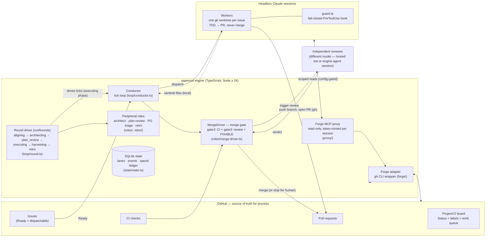

# sapwood

**The autonomous coding loop with governance built in.**

sapwood turns a GitHub backlog into merged, reviewed code: *issues in → reviewed
PRs out*. It is a [Claude Code](https://claude.com/claude-code) plugin that drives
self-directed development through a real governance layer — not a black box that
self-merges and hopes for the best.

> Status: **early development** (pre-v1). The framework is being extracted and
> re-implemented from a proven private project; see [`docs/PLAN.md`](docs/PLAN.md)
> for the full goals, architecture, and roadmap.

## Why it's different

Most autonomous coding tools ask you to trust the model and let it merge. sapwood's
core is the opposite: a **fail-closed safety layer** that structurally separates the
roles in the loop.

- **producer ≠ reviewer ≠ merger** — the worker that writes the code can never
  approve or merge it. Enforced by a fail-closed PreToolUse hook, not a prompt.
- **GitHub is the source of truth** — a ProjectV2 board's `Status` field + issue
  labels *are* the work queue. No hidden database, no opaque state.
- **Configurable review chain** — by default the merge is gated on an independent
  (different-model) code review, the way the source project works: CI green + a fresh
  review → the conductor merges. The reviewer is pluggable, and a *produce-PR-and-stop*
  mode (a human clicks merge) is available when you want a tighter leash.
- **Cost is bounded and legible** — engine-enforced spend ceilings, a dry-run
  preview, and a kill switch.

## How it works

A nested loop dispatches one **headless worker per issue**, each in its own git
worktree. Workers do TDD, open a PR, and request review — but never merge. Worker
completion is signaled by the wrapper writing sentinel files, not by the model's
self-report. The conductor reclaims finished lanes, drives PRs through the review
gate, and (in autonomous mode) merges.

```
GitHub issue (Ready)
   → claim → isolated worktree → TDD → PR (Closes #N) → independent review
   → [default] CI green + review → conductor merges   |   [opt] stop for human merge
   → board: Done
```

## Architecture

<!-- ARCHITECTURE-DIAGRAM: canonical home. docs/dev-guide/README.md links
     here instead of duplicating — keep it single-source. -->



## Documentation

- [`docs/getting-started.md`](docs/getting-started.md) — install, `sapwood init`, the
  first-run trust ramp, slash commands, writing a `Ready` issue.
- [`docs/configuration.md`](docs/configuration.md) — every config key, default, and
  semantics.
- [`docs/security.md`](docs/security.md) — the trust/governance model: guard hook,
  human-merge-only paths, kill switch vs. pause, cost ceilings.
- [`docs/role-paradigm.md`](docs/role-paradigm.md) — the five-element contract every
  peripheral role follows (responsibility, write scope, idempotency, output
  validation, escalation).
- [`docs/troubleshooting.md`](docs/troubleshooting.md) — common failures and what they
  mean.
- [`docs/dev-guide/`](docs/dev-guide/README.md) — **contributor development guide**:
  architecture, repository layout, core modules, persistence schema, and the
  change-risk map for anyone modifying sapwood itself.

## Requirements

- **Node.js ≥ 24** — the engine uses the built-in `node:sqlite` (WAL) for durable
  state, so no native build step.
- **Claude Code CLI ≥ 2.0** — workers run as headless `claude -p` sessions; the
  worker module pins the exact flags it depends on.
- **GitHub CLI (`gh`)** authenticated with the `project` scope (the loop drives a
  ProjectV2 board).

## Roadmap

| Milestone | Focus |
|-----------|-------|
| M0 ✅ | Plugin skeleton, config schema, `IForge` interface, SQLite state — **shipped** |
| M0.5 ✅ | Turnkey onboarding (`sapwood init`: board/labels/milestones) — **shipped** |
| M1 ✅ | Guard port — the fail-closed safety core (ships green first) — **shipped** |
| M2 ✅ | Engine core (conductor + worker + guard wired live) — dogfooded end-to-end; **sapwood now builds sapwood** — **shipped** |
| M3 ✅ | Review gate + opt-in autonomous-merge + cost ceiling + kill switch — the engine can now finish work under the two-gate policy — **shipped** |
| M4 ✅ | Loop driver, commands + status CLI + dry-run, docs — **shipped** |
| v0.2 | Round orchestrator (peripheral roles, gate⓪, round ledger) ✅ — now `sapwood run`'s default driver; Dashboard — built *by* sapwood itself, as the flagship dogfood — **in progress** |

Built in TypeScript. Targets your own / your team's repos first (trusted context),
architected toward public-repo hardening.

## Contributing

See [CONTRIBUTING.md](CONTRIBUTING.md) for the workflow and
[docs/dev-guide/](docs/dev-guide/README.md) for the codebase tour. Security
reports: [SECURITY.md](SECURITY.md).

## License

[MIT](LICENSE).
