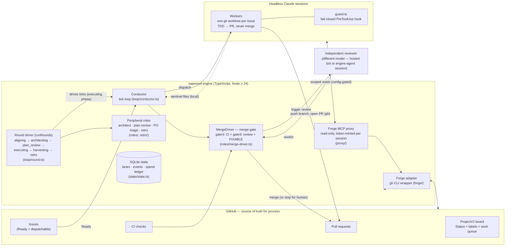

# sapwood

[](https://github.com/herehigher/sapwood/actions/workflows/ci.yml?query=branch%3Amain)
[](LICENSE)

**The autonomous coding loop with governance built in.**

sapwood turns a GitHub backlog into merged, reviewed code: *issues in → reviewed
PRs out*. It is a [Claude Code](https://claude.com/claude-code) plugin that drives
self-directed development through a real governance layer — not a black box that
self-merges and hopes for the best. Adopt it at the level you trust today, then step
up or down through the [L0–L3 autonomy ladder](docs/getting-started.md#l0l3-autonomy-ladder):
read-only preview, one supervised issue, human-merged PRs, or governed unattended
merge.

## Design principles

- **producer ≠ reviewer ≠ merger** — **plugin-enforced:** a worker is prevented
  from approving or merging its own work by the fail-closed guard, rather than
  being asked to refrain in a prompt.
- **GitHub is the source of truth** — **plugin-enforced:** the engine uses the
  ProjectV2 board, issues, pull requests, and checks as process state; it does
  not keep a second workflow database.
- **fail-closed, not advisory** — **plugin-enforced:** an invalid or blocked
  guarded action is denied, and the merge path waits for its configured gates.
  Unlike advisory-only AI review, its conclusion is not merely a recommendation
  that the producer can act around.
- **bounded, legible cost** — **plugin-enforced:** configured spend ceilings,
  dry-run preview, and a kill switch make a run's limits visible and controllable.

**Deployment prerequisite.** The plugin's guard is only one part of a load-bearing
merge boundary. For unattended merge, configure protected branches and a distinct
merger identity as described in [Trust model prerequisites](docs/getting-started.md#trust-model-prerequisites).
A fresh installation does not establish those repository settings.

> Status: **early development** (pre-v1). The framework is being extracted and
> re-implemented from a proven private project; see [`docs/PLAN.md`](docs/PLAN.md)
> for the full goals, architecture, and roadmap.

## Why "sapwood"?

In a tree, sapwood is the living layer between bark and heartwood — the only part
of the trunk that grows. New wood forms there and, as it matures, hardens into
heartwood: the stable core that holds the tree up.

That is this loop. Bark — the fail-closed guard — protects the living layer from
the outside. Sapwood is where the work grows: workers producing new code in
parallel. Heartwood is `main` — and nothing becomes heartwood until it has passed
the review gate and hardened. Growth at the edge, structure at the core,
protection in between.

## Why it's different

Most autonomous coding tools ask you to trust the model and let it merge. sapwood's
plugin enforces a governance path instead of treating review as advice.

- **Configurable review chain** — **plugin-enforced:** the merge path is gated on
  CI and a fresh review before the conductor can merge. The reviewer is pluggable,
  and a *produce-PR-and-stop* mode (a human clicks merge) is available when you
  want a tighter leash. The protected-branch and distinct-identity requirements
  remain [deployment prerequisites](docs/getting-started.md#trust-model-prerequisites).

## Prior art & inspiration

sapwood acknowledges [loop-engineering](https://github.com/cobusgreyling/loop-engineering)
and the [loop-engineering orange book](https://github.com/alchaincyf/loop-engineering-orange-book)
as methodological prior art, including the threads they collect. They inform the
craft of building and documenting agent loops; they are not sapwood's category label.

## How it works

A nested loop dispatches one **headless worker per issue**, each in its own git
worktree. Workers do TDD and push their branch, but do not approve or merge. The
engine opens the PR, and worker completion is signaled by the wrapper writing sentinel
files, not by the model's self-report. The conductor reclaims finished lanes, drives
PRs through the review gate, and (in autonomous mode) merges when the deployment
prerequisites above are in place.

```
GitHub issue (Ready)
   → claim → isolated worktree → TDD → push → engine opens PR (Closes #N) → independent review
   → [default] CI green + review → conductor merges   |   [opt] stop for human merge
   → board: Done
```

## Architecture

<!-- ARCHITECTURE-DIAGRAM: canonical home. docs/dev-guide/README.md links
     here instead of duplicating — keep it single-source. -->



## Documentation

- [`docs/getting-started.md`](docs/getting-started.md) — install, `sapwood init`, the
  L0–L3 autonomy ladder, slash commands, writing a `Ready` issue.
- [`docs/configuration.md`](docs/configuration.md) — every config key, default, and
  semantics.
- [`docs/security.md`](docs/security.md) — the trust/governance model: guard hook,
  human-merge-only paths, kill switch vs. pause, cost ceilings.
- [`docs/role-paradigm.md`](docs/role-paradigm.md) — the five-element contract every
  peripheral role follows (responsibility, write scope, idempotency, output
  validation, escalation).
- [`docs/troubleshooting.md`](docs/troubleshooting.md) — common failures and what they
  mean.
- [`docs/supervision.md`](docs/supervision.md) — the supervision playbook: monitoring a
  run via `status`/`events`, batch open/close rituals, the stop ritual, and the
  governance lines a human or LLM supervisor session operates under.
- [`docs/dev-guide/`](docs/dev-guide/README.md) — **contributor development guide**:
  architecture, repository layout, core modules, persistence schema, and the
  change-risk map for anyone modifying sapwood itself.

## Requirements

- **Node.js ≥ 24** — the engine uses the built-in `node:sqlite` (WAL) for durable
  state, so no native build step.
- **Claude Code CLI ≥ 2.0** — workers run as headless `claude -p` sessions; the
  worker module pins the exact flags it depends on.
- **GitHub CLI (`gh`)** authenticated with the `project` scope (the loop drives a
  ProjectV2 board).

## Roadmap

| Milestone | Focus |
|-----------|-------|
| M0 ✅ | Plugin skeleton, config schema, `IForge` interface, SQLite state — **shipped** |
| M0.5 ✅ | Turnkey onboarding (`sapwood init`: board/labels/milestones) — **shipped** |
| M1 ✅ | Guard port — the fail-closed safety core (ships green first) — **shipped** |
| M2 ✅ | Engine core (conductor + worker + guard wired live) — dogfooded end-to-end; **sapwood now builds sapwood** — **shipped** |
| M3 ✅ | Review gate + opt-in autonomous-merge + cost ceiling + kill switch — the engine can now finish work under the two-gate policy — **shipped** |
| M4 ✅ | Loop driver, commands + status CLI + dry-run, docs — **shipped** |
| v0.2 | Round orchestrator (peripheral roles, gate⓪, round ledger) ✅ — now `sapwood run`'s default driver; Dashboard — built *by* sapwood itself, as the flagship dogfood — **in progress** |

Built in TypeScript. Targets your own / your team's repos first (trusted context),
architected toward public-repo hardening.

## Contributing

See [CONTRIBUTING.md](CONTRIBUTING.md) for the workflow and
[docs/dev-guide/](docs/dev-guide/README.md) for the codebase tour. Security
reports: [SECURITY.md](SECURITY.md).

## License

[MIT](LICENSE).
