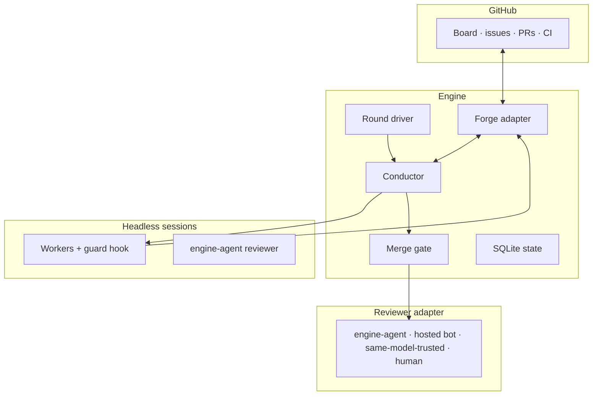
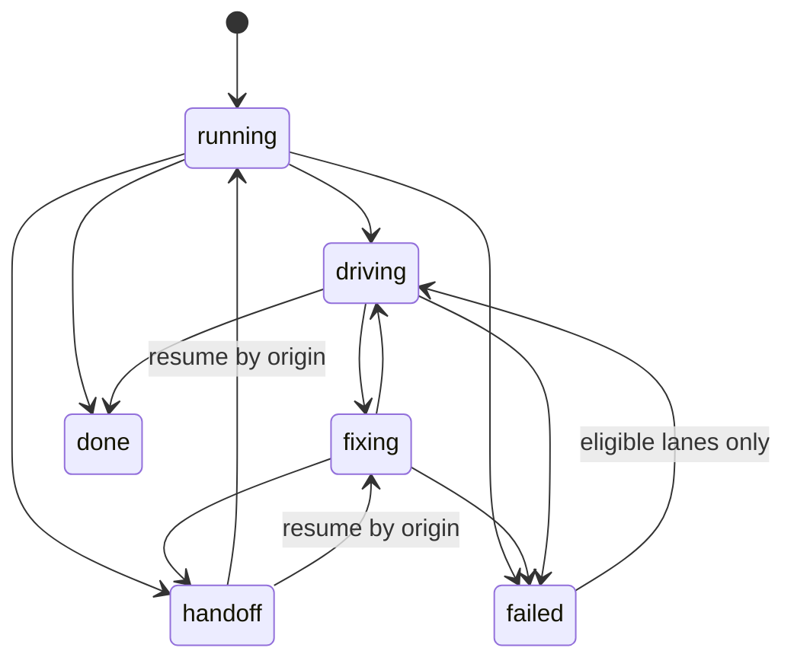

# sapwood

[](https://github.com/herehigher/sapwood/actions/workflows/ci.yml?query=branch%3Amain)
[](https://www.npmjs.com/package/sapwood)
[](package.json)
[](LICENSE)

**The autonomous coding loop with governance built in.**

- issues in → reviewed PRs out.
- producer ≠ reviewer ≠ merger, fail-closed within the guarded built-in tool
  family — branch protection + distinct merger identity are the deployment
  backstop (see [Trust model
  prerequisites](docs/guide/getting-started.md#trust-model-prerequisites)).
- sapwood is a Claude Code plugin bundle (slash commands, skills, the guard
  hook) around the `sapwood` engine CLI. Install the plugin (recommended),
  or run the CLI from npm on its own — both are complete paths.


A worker claims a Ready issue, pushes; the engine opens the PR, gates it on CI + review, then merges or stops for a human.

## Quick start

**Requirements**

- Node.js ≥ 24
- Claude Code CLI ≥ 2.1.209
- `gh` authenticated with the `project` scope
- A GitHub repo with a ProjectV2 board sapwood may drive

```
/plugin marketplace add herehigher/sapwood-plugin
/plugin install sapwood@sapwood
```

```yaml
board:
  owner: YOU
  repo: REPOSITORY
  projectNumber: PROJECT_NUMBER
```

```
npx sapwood@<version> validate
npx sapwood@<version> init
npx sapwood@<version> run --dry-run
```

`init` provisions labels, board lanes, starter files, and (with repo
admin) a deploy key — best-effort, idempotent. `run --dry-run` reads only,
nothing is written.

npm only: `npm i -g sapwood@alpha` gives the same CLI without slash
commands. Pre-release: both channels go live with the first tagged release.

See [Install](docs/guide/getting-started.md#install) and the [L1
recipe](docs/guide/getting-started.md#l1--supervise-one-issue).

## Why sapwood

sapwood exists so a GitHub backlog can drive development without handing
an autonomous worker the keys to its own review — governed
autonomy, stepped up or down as trust is earned, trusted repos first. Like
sapwood in a tree, growth happens at the living edge, protected by bark,
until it hardens into heartwood.

## Design principles

- **producer ≠ reviewer ≠ merger** — plugin-enforced for the guarded
  built-in tool family; documented MCP/host blind spots; branch protection
  + distinct merger identity are the deployment backstop.
- **GitHub is the process truth** — board, issues, PRs, checks are the
  queue; no second queue.
- **fail-closed, not advisory** — a blocked action is denied outright, not
  merely advised against.
- **deterministic engine, model tokens only on legs that need thought** —
  orchestration is plain TypeScript.
- **rare edges degrade to `needs-human`, never to more machinery** —
  low-probability edges get a human, not new code.
- **legible, ledger-checked cost** — a capability with its existing
  caveats, not a differentiator.

**Three sources of truth:**

- **GitHub** — cross-actor process truth: board status, labels, issues, PRs.
- **SQLite** — the engine's own actions: dispatched, observed, spent.
- **Repository docs** — durable knowledge: what is true now.

See [Persistence](docs/dev-guide/06-persistence.md#principles--boundary--what-belongs-in-sqlite).

## How it is different

Claude Code is today's worker runtime — sapwood dispatches it as headless
sessions; sapwood is the loop and governance layer above the coding agent,
not a competitor to it.

| What sapwood states | What to ask any harness |
| --- | --- |
| Merge authority: only the merge driver calls merge — never the producer. | Who can call merge, and can producer reach it? |
| Enforcement: fail-closed within the guarded built-in tool family; not a sandbox; documented MCP/host blind spots. | What tool surface is mediated, and what is ambient? |
| Queue & exit: GitHub holds process truth; the trail survives uninstall and the runner machine. | Where does the queue live, and what remains after? |
| Control flow: deterministic TypeScript orchestration, not model-decided transitions. | Is scheduling code, or a prompt the model can argue around? |
| Interruption: soft-budget handoff (resumable work) → kill switch drains → emergency stop hard-kills and sacrifices in-flight WIP. | What happens to in-flight work at the e-stop? |

See [`docs/security.md`](docs/security.md).

## Architecture


GitHub holds process truth; the engine orchestrates; headless sessions do the work; a pluggable adapter reviews it.


A worker lane's lifecycle: `done` is terminal; `failed` can resume; a soft-budget `handoff` returns to where it started.

Round phases: `aligning → architecting → plan_review → executing →
harvesting → retro → closed`. Default board lanes: `Todo → Ready → In
Progress → Done` (names are configurable). Detail:
[05](docs/dev-guide/05-core-modules.md) ·
[06](docs/dev-guide/06-persistence.md) ·
[loop-walkthrough](docs/reference/loop-walkthrough.md).

## Autonomy levels

Lower = safer, more human effort; higher = more autonomous.

| Level | Unattended | Merges | Watches | To step up |
| --- | --- | --- | --- | --- |
| [L0 — Observe](docs/guide/getting-started.md#l0--observe) | Nothing — read-only | n/a | — | Move to L1 (single issue) |
| [L1 — Supervise one issue](docs/guide/getting-started.md#l1--supervise-one-issue) | Claim, push, open PR, review (1 issue) | Human | Human | Restore round driver; human merge |
| [L2 — Delegate work, keep merge](docs/guide/getting-started.md#l2--delegate-work-keep-merge) | Full rounds, capped lanes | Human | Human | Trust review/CI, switch merge mode |
| [L3 — Governed unattended merge](docs/guide/getting-started.md#l3--governed-unattended-merge) | Full rounds, gated merge | Conductor | Human | Add an LLM watcher |
| L4 — LLM-supervised run | Full rounds, gated merge (as L3) | Conductor | Trusted LLM | Top of the ladder |

L4 keeps L3's engine authority; scope: watch, record, nag, clear breaker
parks (with reason), trip pause/kill switch (see [Governance
lines](docs/guide/supervision.md#governance-lines)). By default it never
adjudicates merge; owner may extend by explicit session-start
authorization. `sapwood:human-merge-only` PRs stay a human's call.

Human controls (pause / kill switch / e-stop) exist at every level (see
[Human controls](docs/security.md#human-controls-three-tiers)); L3 and L4
require the [Trust model
prerequisites](docs/guide/getting-started.md#trust-model-prerequisites).

## Status

Implemented on main, pre-release: engine, guard, round orchestrator,
dashboard. Release chain (marketplace catalog, npm publish) in progress.
See [CHANGELOG.md](CHANGELOG.md) "Unreleased" and [PLAN.md "Current
milestone"](docs/PLAN.md#current-milestone).

## Documentation

- [`getting-started.md`](docs/guide/getting-started.md) — install,
  `sapwood init`, the autonomy ladder.
- [`security.md`](docs/security.md) — the trust/governance model.
- [`docs/README.md`](docs/README.md) — the documentation map.
- [`dev-guide/README.md`](docs/dev-guide/README.md) — the contributor tour.

## Acknowledgements

sapwood is inspired by, and acknowledges:

- [Harness Engineering](https://github.com/walkinglabs/learn-harness-engineering)
- [orange book](https://github.com/alchaincyf/loop-engineering-orange-book)
- [loop-engineering](https://github.com/cobusgreyling/loop-engineering)
- [@AnatoliKopadze](https://x.com/AnatoliKopadze/status/2068328135611822149)
- [@0xCodez](https://x.com/0xCodez/status/2064374643729773029)
- [@0xCodez](https://x.com/0xCodez/status/2079165300625330317)

These inform the craft of building and documenting agent loops —
methodological prior art, not sapwood's category label.

## Contributing · Security · License

See [CONTRIBUTING.md](CONTRIBUTING.md) for the workflow and
[docs/dev-guide/](docs/dev-guide/README.md) for the codebase tour. Security:
[SECURITY.md](SECURITY.md).

[MIT](LICENSE).
