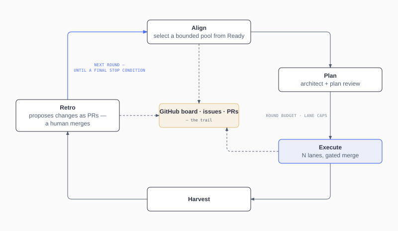

# sapwood

[English](README.md) · [日本語](README.ja.md) · 简体中文

本文为 README.md（截至 [a83d099b](https://github.com/herehigher/sapwood/blob/a83d099b/README.md)）的译文；如有出入，以英文版为准。

**自主编码，接受治理。**

- issue 输入 → 经过评审的 PR（拉取请求，Pull Request）输出。
- producer ≠ reviewer ≠ merger，在受保护的内置工具家族范围内故障关闭（fail-closed）
  — 分支保护加上独立的合并者身份是部署层面的最后防线（见
  [信任模型前提条件](docs/guide/getting-started.md#trust-model-prerequisites)）。
- sapwood 是围绕 `sapwood` 引擎 CLI 的 Claude Code 插件包（斜杠命令、技能、守护
  钩子（guard hook））。安装插件（推荐），或单独从 npm 运行 CLI —— 两条路径都是完整的。

<!-- source: docs/assets/hero-loop.mmd — regenerate per docs/assets/diagram-style.md -->

人类将 issue 签署为 Ready；生产者（producer）推送代码，与此同时故障关闭的守护
钩子在受保护的内置工具范围内拒绝 approve 与 merge（分支保护是最后防线）；引擎打开
或接管该 PR，并以 CI 加独立评审作为门禁 —— 发现的问题在修复次数上限下循环回去，
不收敛则停下来等待人类介入。

**[观看仪表盘演示 →](https://herehigher.github.io/sapwood/)** 在浏览器中用仪表盘回放一段已录制的运行过程 —— 无需安装。

## 快速开始

**前置要求**

- Node.js ≥ 24
- Claude Code CLI ≥ 2.1.209
- 已用 `project` 权限范围完成认证的 `gh`
- 一个拥有 sapwood 可驱动的 ProjectV2 看板的 GitHub 仓库

```
/plugin marketplace add herehigher/sapwood-plugin
/plugin install sapwood@sapwood
```

```yaml
board:
  owner: YOU
  repo: REPOSITORY
  projectNumber: PROJECT_NUMBER
```

```
npx sapwood@<version> validate
npx sapwood@<version> init
npx sapwood@<version> run --dry-run
```

`init` 会配置标签、看板泳道（lane）、起始文件，以及（在具备仓库管理员权限时）一个
部署密钥 —— 尽力而为且幂等。`run --dry-run` 只读，不写入任何内容。

仅使用 npm：`npm i -g sapwood@alpha` 提供相同的 CLI，但没有斜杠命令。
预发布阶段：两条渠道都会随首个打标签的发布版本一同上线。

参见[安装](docs/guide/getting-started.md#install)与
[L1 方案](docs/guide/getting-started.md#l1--supervise-one-issue)。

## 为什么选择 sapwood

sapwood 把 GitHub 的积压任务转变为受治理的自主性，优先面向受信任的仓库 —— 没有
任何生产者掌握着评审自己工作的钥匙。就像树木中的 sapwood（边材）一样，它在生长的
边缘萌发，并硬化为心材。

## 设计原则

- **producer ≠ reviewer ≠ merger** —— 针对受保护的内置工具家族由插件强制执行；
  已文档化 MCP／宿主环境的盲区；分支保护加上独立的合并者身份是部署层面的最后防线。
- **GitHub 是过程真相的来源** —— 看板／issue／PR／检查项构成队列。
- **故障关闭，而非仅作提示** —— 被拦截的操作是被拒绝，而不是仅被提示。
- **确定性引擎，模型 token 只用在需要思考的环节** —— 编排逻辑是纯粹的 TypeScript。
- **罕见边角情形退化为 `needs-human`，绝不增加新机制** —— 低概率的边角情形交给
  人类处理，而不是新写代码。
- **可读、且与账本（ledger）核对过的支出记录** —— 上限会与账本核对；非决定性的
  评审尝试与子代理扇出可以不计入账本（见[成本上限](docs/security/cost-ceilings.md)）。

**三个真相来源：**

- **GitHub** —— 跨主体的真相：看板、标签、issue、PR。
- **SQLite** —— 引擎自身的行动记录：已派发、已观测、已花费。
- **仓库文档** —— 持久性知识：当下什么是真的。

参见[持久化](docs/dev-guide/06-persistence.md)。

## 与其他方案的不同之处

Claude Code 是当下的工作者（worker）运行时 —— sapwood 以无头（headless）会话的
形式派发它；sapwood 是叠加在编码代理之上的循环与治理层，而不是与它竞争的产品。

| sapwood 所声明的 | 应向任何执行框架追问的 |
| --- | --- |
| 合并权限：生产者从不调用 merge；引擎的自主合并要经过合并驱动器；除此之外由人类 —— 或经所有者明确授权的操作员会话 —— 来合并。 | 谁能调用 merge，生产者能否触达它？ |
| 强制执行：在受保护的内置工具家族范围内故障关闭；不是沙箱；已文档化 MCP／宿主环境的盲区。 | 哪些工具面被中介控制，哪些是不受控的（ambient）？ |
| 队列与退出：GitHub 保存过程真相；记录在卸载和运行机器之后仍然留存。 | 队列存放在哪里，之后还会留下什么？ |
| 控制流：确定性的 TypeScript，而不是由模型决定的状态迁移。 | 调度是代码，还是模型可以绕过的提示词？ |
| 中断：软预算移交（可恢复）→ 终止开关（kill switch）排空 → 紧急停止（e-stop）硬性终止并牺牲正在进行中的工作。 | 紧急停止时，正在进行中的工作会怎样？ |

参见 [`docs/security.md`](docs/security.md)。

## 架构

<!-- source: docs/assets/architecture.mmd — regenerate per docs/assets/diagram-style.md -->

GitHub 保存过程真相；引擎编排并记录派发与计入账本的支出；生产者可以推送代码，故障
关闭的守护钩子在受保护的内置工具范围内拒绝 approve 与 merge；评审者（reviewer）的
裁决对 merge 进行门控；人类可以在任意时刻暂停、排空或停止。

<!-- source: docs/assets/round-loop.mmd — regenerate per docs/assets/diagram-style.md -->

一个轮次（round）是把一批任务包裹在外围环节中：对齐（align）、规划（plan）、在轮次
预算与泳道上限下执行（execute）、收获（harvest），以及只能提出建议的复盘
（retro）—— 复盘的落地要经由人类合并的 PR。

轮次阶段：`aligning → architecting → plan_review → executing →
harvesting → retro → closed`。默认看板泳道：`Todo → Ready → In
Progress → Done`（名称可配置）。更多内容见：
[05](docs/dev-guide/05-core-modules.md) ·
[06](docs/dev-guide/06-persistence.md) ·
[流程走查](docs/reference/loop-walkthrough.md)。

## 自主等级

等级越低越安全、需要的人力越多；等级越高越自主。

| 等级 | 无人值守 | 合并 | 监督 | 如何升级 |
| --- | --- | --- | --- | --- |
| [L0 — 观察](docs/guide/getting-started.md#l0--observe) | 无操作 —— 只读 | 不适用 | — | 升级到 L1（单个 issue） |
| [L1 — 监督单个 issue](docs/guide/getting-started.md#l1--supervise-one-issue) | 认领、推送、开 PR、评审（1 个 issue） | 人类 | 人类 | 恢复轮次驱动器；由人类合并 |
| [L2 — 委派工作，保留合并权](docs/guide/getting-started.md#l2--delegate-work-keep-merge) | 完整轮次，泳道有上限 | 人类 | 人类 | 信任评审／CI，切换合并模式 |
| [L3 — 受治理的无人值守合并](docs/guide/getting-started.md#l3--governed-unattended-merge) | 完整轮次，有门禁的合并 | 协调者（Conductor） | 人类 | 加入一个 LLM 监督者 |
| L4 — LLM 监督下运行 | 完整轮次，有门禁的合并（与 L3 相同） | 协调者（Conductor）（或经明确授权的监督者） | LLM | 阶梯顶端 |

L4 保留了 L3 的引擎权限，并加入一个受信任的 LLM 监督者，其职责范围是监视、记录、
提醒、触发暂停／终止开关，以及在给出理由后清除断路器停放状态（breaker park）——
默认情况下它从不裁决合并；所有者可以通过在会话开始时的明确授权来扩展这一点；
`sapwood:human-merge-only` 的 PR 始终由人类裁决 —— 对引擎的合并路径而言这是结构性
限制，对经授权的操作员会话而言这是策略性限制（见
[治理界线](docs/guide/supervision.md#governance-lines)）。

人类控制手段（暂停／终止开关／紧急停止）适用于每一个等级
（[人类控制手段](docs/security.md#human-controls-three-tiers)）；L3／L4 需要满足
[信任模型前提条件](docs/guide/getting-started.md#trust-model-prerequisites)。

## 状态

预发布阶段。每个版本以预发布 dist-tag（`sapwood@alpha`）发布到 npm，推送到
marketplace catalog `herehigher/sapwood-plugin`，并附带构建证据发布为 GitHub Release。
参见 [CHANGELOG.md](CHANGELOG.md) 以及 [PLAN.md 的「Current milestone」](docs/PLAN.md#current-milestone)。

仪表盘功能可用但尚未打磨；欢迎 UI/UX 设计方面的贡献 —— 参见
[help wanted](https://github.com/herehigher/sapwood/labels/help%20wanted)。

## 文档

- [`getting-started.md`](docs/guide/getting-started.md) —— 安装、`sapwood init`、
  自主等级阶梯。
- [`security.md`](docs/security.md) —— 信任／治理模型。
- [`docs/README.md`](docs/README.md) —— 文档地图。
- [`dev-guide/README.md`](docs/dev-guide/README.md) —— 贡献者导览。

## 致谢

灵感来自：

- [walkinglabs/learn-harness-engineering](https://github.com/walkinglabs/learn-harness-engineering) —— 一门关于 harness engineering 的项目制课程：让编码代理可靠运行所需的环境、状态、验证与控制机制。
- [alchaincyf/loop-engineering-orange-book](https://github.com/alchaincyf/loop-engineering-orange-book) —— 关于循环工程（loop engineering）的免费中文指南（橙皮书）：架构、成本，以及真实世界中的代理循环；「设计一个替你向代理下达提示词的系统」。
- [cobusgreyling/loop-engineering](https://github.com/cobusgreyling/loop-engineering) —— 用于设计围绕编码代理的控制循环的模式、启动模板与 CLI（「不要再手写提示词，去设计循环」）。
- [@AnatoliKopadze — what a loop is](https://x.com/AnatoliKopadze/status/2068328135611822149) —— 验证、状态与停止条件，是把重复变成循环的三个要素；判断一项任务是否值得做成循环的四条件测试。
- [@0xCodez — from prompter to loop designer](https://x.com/0xCodez/status/2064374643729773029) —— 14 步路线图：循环何时能够回本、五个构成要素，以及合并或部署前的人类关卡。
- [@0xCodez — graph engineering](https://x.com/0xCodez/status/2079165300625330317) —— 从线性代理链条走向图结构的 14 步路线图：带契约的节点、作为数据的边，以及跨子代理集群的扇出／验证／收敛。

它们为这门技艺提供了启发 —— 是方法论上的既有实践，而不是 sapwood 的类别标签。

## Contributing · Security · License

参见 [CONTRIBUTING.md](CONTRIBUTING.md)（工作流程）与
[docs/dev-guide/](docs/dev-guide/README.md)（导览）。安全事项：
[SECURITY.md](SECURITY.md)。

[MIT](LICENSE)。

维护者：[@kanhigher](https://x.com/kanhigher) —— 提问与 bug 报告请走
[issues](https://github.com/herehigher/sapwood/issues)。
