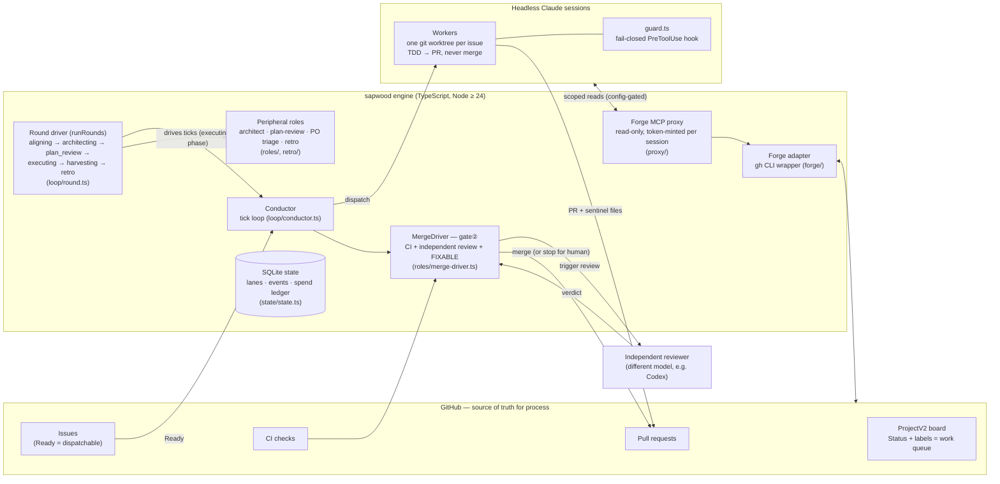

# sapwood development guide

A contributor-facing tour of the codebase: what the pieces are, where they
live, how to run and test them, and which parts are dangerous to touch.
User-facing docs live one level up ([getting-started](../getting-started.md),
[configuration](../configuration.md), [security](../security.md)); this guide
is for people **changing sapwood itself**.

> Status tracks the engine at pre-v1. Sections marked **TODO (v0.2)** cover
> the dashboard, which is designed ([frontend-design.md](../frontend-design.md))
> but not yet built.

## System architecture

<!-- ARCHITECTURE-DIAGRAM: maintained here; the root README embeds the same
     diagram — keep the two in sync when editing. -->

**The one invariant everything else hangs off:** producer ≠ reviewer ≠ merger.
The worker that writes code never approves or merges it; the guard hook
enforces this fail-closed at the tool-call layer, and the engine's
`MergeDriver` — driven by the conductor, never by a session — is the only
code path that ever calls merge.

## Guide sections

| Section | Covers |
| --- | --- |
| [01 — Tech stack](01-tech-stack.md) | Languages, runtime, dependencies, tooling choices and why |
| [02 — Repository layout](02-repo-layout.md) | Every directory, what owns what, core vs. hands-off areas |
| [03 — Running locally](03-running.md) | Install, build, init, first run, config and environment |
| [04 — Test & quality commands](04-commands.md) | test / lint / typecheck / build, how CI runs them |
| [05 — Core modules](05-core-modules.md) | Conductor, rounds, roles, forge, guard, proxy — where to look when changing behavior |
| [06 — Persistence layer](06-persistence.md) | SQLite schema tour: every table, migrations, crash-consistency rules |
| [07 — Dashboard](07-dashboard.md) | **TODO (v0.2)** — designed, not yet built; what exists today |
| [08 — Change-risk map](08-change-risk.md) | Human-merge-only files, high-risk seams, rules that must survive any refactor |
