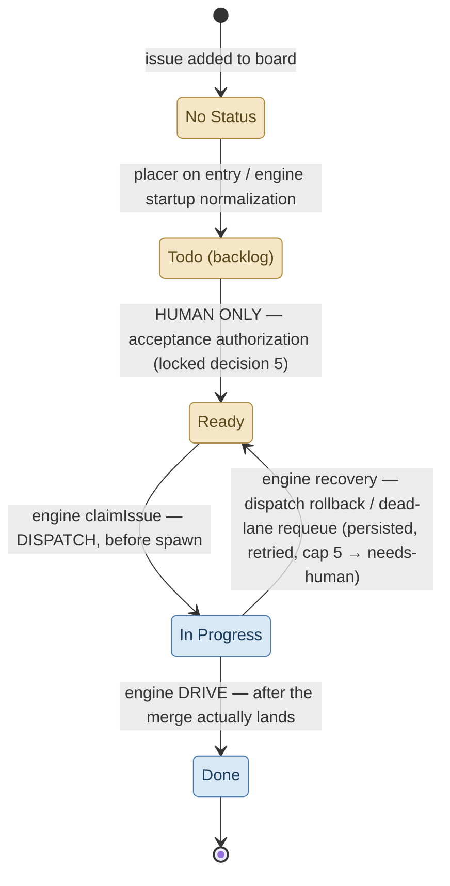

# Loop walkthrough — behavior reference, boundaries included

> **Process record.** Internal design/research artifact from sapwood's own development history — not end-user documentation.

What the engine actually does, step by step, including every boundary and
failure path — written for two readers: the **operator** running sapwood, and
the **#17 dashboard** (its architect needs this to know what "truth" the UI
must render and where the frontend's responsibility ends).

Companions: [`frontend-design.md`](frontend-design.md) owns the UI decisions;
[`round-artifact.md`](round-artifact.md) owns the round data contract;
[`../PLAN.md`](../PLAN.md) owns the why (architecture, locked decisions,
roadmap). This doc owns *behavior*. Code anchors: `round.ts` (round loop),
`conductor.ts` (tick), `cli.ts` (entry/exit), `state.ts` (durable truth).

## 1. The main line — a round's life

`sapwood run` (default driver `rounds`) after fail-fast startup (config,
promptFile, stop-milestone validation — any failure aborts with **zero
dispatch**):

1. **Loop top.** Signal or final `stop.*` already hit? → wind down (§3).
2. **Standby probe** (#125). Local SQLite reads + pure GitHub API calls,
   no LLM: any **carried lane** still needing the tick loop (in-flight,
   resumable handoff, or gated-reentry candidate — #433)? Ready issues?
   gate⓪ candidates? open milestone work? plan-doc
   goals? All empty *and* the last round was idle → **standby**: withhold the
   round, wait `tickIntervalSec × 2^n` (capped at
   `round.standby.backoffCapSec`), emit `standby-wait`, re-probe. Any hit →
   `standby-exit`, proceed. A restart resets the backoff (in-memory only).
3. **Open or resume a round.** An unclosed round in the `rounds` table is
   picked up at its persisted phase cursor (§4); otherwise `startRound`.
4. **Peripheral first half** — `aligning` (PO decomposes goals / triages
   plan-less issues), `architecting` (one cross-issue design pass, fed the
   align summary), `plan_review` (gate⓪: reviewer ⇄ drafter self-heal,
   ≤ `maxDraftCycles`, then `needs-human`). Every phase: KILL_SWITCH checked
   first; marker written after; phase cursor advanced after that. All roles
   are zero-grant sessions — structured output in, engine executes writes.
   `aligning` is also the round's steering entry point (#126): if the fixed
   `.sapwood/DIRECTIVE.md` (not a config key) exists, its content is
   substituted into the aligning and architecting prompts as
   `{{round.directive}}` — a human's why/what for this round, not a code
   change — then archived to `.sapwood/directives/round-<id>.md` so it applies
   exactly once. Not tied to pause/resume: drop the file any time before this
   phase runs.
5. **`executing`.** ONE dispatch-enabled tick (the batch, ≤
   `lanes.roundDispatchCap`, also bounded by free lanes under `lanes.max`),
   then **drain ticks** (dispatch frozen) until zero lanes in flight. DRIVE
   runs during drain, so this round's PRs merge *before* the round closes.
   Every ledgered session after round open — opening peripherals plus worker
   legs — is tallied against `cost.roundBudgetUsd` from a durable id cursor.
   Over budget blocks dispatch, **never kills a running worker**.
6. **Peripheral second half** — `harvesting` (judgment + needs-human
   briefings over the engine-built artifact), `retro` (engine-built digest
   in; scratch-file proposal out → engine verifies the branch exists and
   opens the PR, or records `retro-pr-degraded`).
7. **Close.** The round-summary artifact is assembled from the ledger,
   validated, upserted into `round_artifacts`, rendered to
   `.sapwood/rounds/round-<id>.md`; the round row goes `closed`. An idle round
   waits one tick interval before the loop re-enters at step 1.

Note the asymmetry: **milestone scoping** (`round.milestone`, or the
`--milestone M` flag) bounds *what* the loop works on; **stop conditions**
(`--stop-after-issues/-prs`, `--stop-on-milestone`, config `stop.*`) bound
*when* it exits. `--milestone M` sets both at once.

## 2. Inside one tick (`conductor.ts tick()`, strict order)

1. **EMERGENCY_STOP gate** (#293) — checked BEFORE the kill switch. Active →
   this tick is terminal-reclaim + **immediate hard-kill** of every
   `running`/`fixing` lane, no drain window, no handoff request ever sent.
   Nothing else runs. In-flight work is killed outright — **WIP not already
   committed/pushed is lost**; killed lanes end `failed` with the existing
   needs-human escalation. Both `EMERGENCY_STOP` and `KILL_SWITCH` present →
   E-STOP wins (it is the stricter tier).
2. **KILL_SWITCH gate** — active → this tick is terminal-reclaim + drain
   ONLY (handoff requests; hard kill past `cost.drainWindowSec`). Nothing
   else runs. A received SIGTERM/SIGINT takes this same gate (#380, §3) — one
   drain path, two ways in.
3. **PAUSE / wind-down read** — freezes DISPATCH only; reclaim, rollback
   retry, and DRIVE proceed. Fresh file check every tick, no restart needed.
4. **Rollback retry** — pending board mutations from prior failures, before
   any new work; bounded by `recovery.rollbackRetryCap`, then
   `rollback-escalated`.
5. **GATED RECLAIM** (#147) — failed lanes still holding a PR whose
   `needs-human` label a human has since removed re-enter DRIVE, up to
   `lanes.gatedReentryCap` per issue (`gated-reentry` /
   `gated-reentry-capped` events; capped lanes are latched and re-labeled).
   Terminality is decided **before** the cap (#484): a merged PR goes back to
   DRIVE for its ordinary `merged` terminal at any attempt count
   (`gated-reentry-merged`, no attempt burned), and a CLOSED issue is terminal
   whatever its PR says — latched and surfaced once
   (`gated-reentry-issue-closed`), never re-driven and never re-labeled. Only a
   live issue with a live PR ever reaches the cap, so the capped re-label on a
   finished lane is unreachable by construction rather than by a guard.
6. **RECLAIM** — every running lane classified by four signals (terminal
   sentinel `.handoff`/`.done`/`.failed`; heartbeat age vs
   `worker.heartbeatStaleSecs`; wrapper liveness): KEEP / terminal-record /
   DEAD. A DEAD lane with an open PR is rescued to `driving` (never
   requeued — a second worker racing the PR is the bug class this closes);
   a possibly-dirty worktree is retained on disk and escalated.
7. **CEILING** — `dailyBudgetUsd` + `maxWallClockSec` (post-hoc: spend is
   known only at lane end; overshoot bounded ≈ dispatch cap × worker soft
   budget). Breach → engine-wide dispatch freeze + drain + escalate. The
   engine **keeps ticking while frozen** — see §6.
8. **DRIVE (gate②)** — each `driving` lane's PR: CI green + fresh
   cross-model review → merge (`merged`); review demands work → back to a
   fix lane (`prFixCap` bounded); no PR / unresolvable → `needs-human`.
9. **DISPATCH** — Ready queue ordered by priority (meta-rank issues yield to
   coding work — anti-starvation floor), each candidate checked against:
   ceiling, already-in-flight, round budget, dispatch cap, free lanes.
   Skips are recorded with reasons — dispatch decisions are reconstructible.

## 3. Ways the loop ends

| Path | Trigger | In-flight lanes | Rest of round | Exit code |
|---|---|---|---|---|
| Stop condition | `stop.*` / `--stop-*` hit | **finish fully** | harvest+retro run, round closes | 0 |
| Signal (1st) | SIGINT/SIGTERM | **drained**: dispatch freezes, live lanes asked to hand off, handoff window (`drainWindowSec`) → hard kill | harvest+retro run, round closes | 0 |
| Signal (2nd) | SIGINT/SIGTERM while draining | abandoned — no drain, no reclaim | abandoned mid-phase | **128+signum** (143 TERM / 130 INT) |
| Kill switch | `.sapwood/KILL_SWITCH` | handoff window (`drainWindowSec`, default 300 s) → hard kill | **skipped** — round left unclosed | **1** |
| Crash | process death | orphaned; reclaimed by 4-signal logic on restart | round left unclosed | — |
| (PAUSE) | `.sapwood/PAUSE` | not an exit: dispatch freezes, everything else continues | rounds keep cycling | — |

Kill switch is the only *sentinel* path that skips harvest/retro, and — apart
from a second signal's hard exit — the only non-zero exit. On restart after
kill/crash/hard exit, the unclosed round resumes at its phase cursor and closes
out *before* any new round opens.

**Signals are the third stop channel, beside the two sentinels** (#380).
Operators and service managers (systemd, launchd, CI) reach for a signal
first, so SIGTERM/SIGINT is wired to the *same* code as `.sapwood/KILL_SWITCH`:
one flag threaded into `tick()`'s single top-of-tick gate, so the two can't
drift apart. From the first tick after the signal, DISPATCH, DRIVE and new
RESUME are frozen (an already-spawned resume child is adopted, then drained
with everything else) and every `running`/`fixing` lane hands off gracefully
(WIP commit+push, `.handoff`) — the same bounded `drainWindowSec` window,
hard-killing and escalating whatever refuses. Three deliberate differences
from the sentinel:

- The reason recorded on the drain (events, `sapwood status`) is
  `stop-signal`, never `kill-switch` — nobody should go hunting for a sentinel
  file that was never written.
- The *round* still closes properly (harvest+retro run, exit 0). A signal says
  "stop taking on work", the sentinel says "stop, now, and stay stopped" —
  only the sentinel is durable and survives a restart.
- A **second** signal received while draining exits immediately, with the
  POSIX `128+signum` code for whichever signal it was (143 for SIGTERM, 130
  for SIGINT — so a systemd unit or CI wrapper reads the same convention it
  does from any other daemon); in-flight lanes are left to the crash-reclaim
  path. The drain is bounded but not instant, and an operator who asks twice
  should never have to reach for SIGKILL.

## 4. Crash & resume semantics (rerun-not-resume)

- Only two things survive a crash per round: the **phase cursor** and the
  current phase's **idempotency marker** (`advanceRoundPhase` clears the
  marker on every advance — a stale marker can never leak into the next
  phase). A resumed phase re-runs; a non-null marker tells the stub its side
  effects already externalized, so it returns without duplicating them.
- A crash mid-`executing` resumes into **drain-only** (`freshBatch=false` —
  no re-dispatch); round-budget tracking degrades to the still-active lane
  set (a lane that finished in the crash gap is under-counted — accepted).
- The round artifact is **upserted** — a crash between artifact write and
  round close re-runs the close path and overwrites rather than duplicates.

## 5. Budget & safety tiers

| Tier | Knob | On breach | Kills work? |
|---|---|---|---|
| Worker (soft) | `worker.budgetUsdSoft` | graceful handoff: WIP commit+push, `.handoff` | never |
| Round (soft) | `cost.roundBudgetUsd` | no further waves; drain continues | never |
| Engine day (hard) | `cost.dailyBudgetUsd` | freeze all dispatch + drain + escalate | after drain window |
| Engine process (hard) | `cost.maxWallClockSec` (default **24 h**, #431: a per-process attention alarm — one clock per process life, fresh on every restart) | same freeze+drain | after drain window |
| Human (hard) | `.sapwood/KILL_SWITCH` | freeze + drain + hard kill, exit 1 | after drain window |
| Human (signal) | SIGTERM / SIGINT (#380) | the same freeze + drain, exit 0 once drained; a second signal exits at once with 128+signum | after drain window |
| Human (emergency, #293) | `.sapwood/EMERGENCY_STOP` | freeze + **immediate** hard kill, exit 1 — no drain window, no handoff request, checked before KILL_SWITCH so it wins if both are present | **on this same tick** |

Soft tiers preserve work (hard-killing a worker re-burns the same tokens on
requeue, forever); hard tiers exist so the ceiling is actually a ceiling. The
three human-triggered stop tiers are, honestly, not equally gentle: PAUSE only
withholds new dispatch (in-flight work finishes); KILL_SWITCH and the signal
tier drain first, giving a running lane up to `drainWindowSec` to reach a
terminal sentinel on its own; EMERGENCY_STOP skips the drain step entirely —
every `running`/`fixing` lane's process group is killed outright, and any WIP
that lane had not already committed and pushed is lost. Reach for it only
when a lane is doing something actively dangerous (credential exposure,
destructive filesystem/API calls, runaway cost) and cannot wait out even a
zero-length drain tick.

## 6. The state truth table — reading the engine at a glance

**This section is the dashboard's core job.** Every "what is it doing?"
question has a deterministic answer assembled from four sources: sentinel
files, the state DB (`workers`, `rounds`, `events`, `spend_ledger`,
`round_artifacts`), the process, and (only for links) GitHub. The classic trap
is **"alive but silent"** — five different truths render identically in a
terminal. A dashboard that cannot distinguish these five has failed its
one job:

| State | The truth | Decisive evidence | What the UI must say |
|---|---|---|---|
| **Working** | lanes running / PRs driving | `workers` rows in `running`/`driving`; recent `events` | normal: lanes, phase, spend |
| **Standby** (#125) | provably nothing to do; parked | `standby-wait` events (attempt n, waitSec) newer than any `dispatched`; open round: none | "Standby — nothing Ready; probing every X min (backoff n)". **Not** an error state |
| **Paused** | human froze dispatch; in-flight work continues | `.sapwood/PAUSE` exists | "Paused by operator — in-flight lanes finishing; remove .sapwood/PAUSE to resume" |
| **Ceiling-frozen** | hard tier breached; engine ticks but dispatches nothing | per-reason `ceiling-breach-entered` events (#431) + the `ceiling_breach` row's current reasons; spend ≥ `dailyBudgetUsd`, or process age ≥ `maxWallClockSec` (24 h per process life — a restart starts a fresh clock, so an overnight "hang" here means the process genuinely ran a full day) | "Frozen: daily budget — resumes at midnight" / "wall-clock attention alarm — restart renews". Rust-red, needs a person |
| **Draining to kill** | KILL_SWITCH tripped, or a stop signal received (#380); handoff window running | `.sapwood/KILL_SWITCH` exists (sentinel path), else the `ceiling_breach` row reads `stop-signal`; workers transitioning to handoff. No sentinel is ever written for a signal — the request itself dies with the process, and the breach row lingers until the next run's first healthy tick clears it, so pair it with a live process before calling it "draining" | countdown against `drainWindowSec`; "will exit 1" (sentinel) / "stopping — will exit 0 once drained" (signal) |
| **Winding down** | stop condition hit; finishing the round | `round-stop`/stop-condition events; dispatch skipped with reason | "Stop condition met (N issues merged) — finishing in-flight work" |
| **Escalated dry** | board empty because everything needs a human | Ready empty + `needs-human`-labeled issues / `drive-needs-human`, `plan-review-escalated` events | pin the escalation list; "the loop is waiting on YOU, not broken" |
| **Stalled PR** | lane parked in `driving` on a PR reporting no CI | `driving` lane age ≫ normal; (GitHub: PR mergeable=CONFLICTING builds **no merge ref → zero check-suites** — looks like CI never ran). Since #270 the engine senses CONFLICTING each tick and — in conductor-merge mode with `prFixCap > 0` and no hold — routes it into the conflict fix path, so this state self-heals; `prFixCap: 0` escalates instead (see Escalated), and `produce-pr-and-stop` reports without acting (stays `driving` by design). Persistence in the self-healing config means the fix lane itself is stuck | "PR #N conflicted — in the conflict fix path (round n/cap)", or the applicable held, escalation, or report-only state when the config routes there |
| **Dead** | process gone; lanes orphaned | `lastTickAt` age ≫ `tickIntervalSec`; no process | "Engine not running since T — restart resumes round R at phase P" |

Derivation rule: **files beat DB beats staleness** — sentinels are absolute;
then the newest relevant event; a stale `lastTickAt` overrides everything
("whatever the DB says it was doing, it isn't"). The header's one-word state
in frontend-design.md §3-A/§8 is computed from exactly this table and carries
the matching vocabulary.

## 7. Board Status ownership — who moves what, when

Board Status transitions each have **exactly one owner**, and ownership is
structural, not conventional: peripheral roles carry no engine-granted `gh`
capability at all; the normal worker profile pairs a `Bash(gh *)` grant with
a deny list (`gh pr merge`, `gh pr ready`, `gh pr review --approve`/
`--request-changes`, `gh release`, governance-flagged `gh issue edit`, `gh
label`, `gh project`), and the guard hook independently blocks those same
verbs plus `gh graphql` mutations at the argv layer. Neither layer is
absolute — an inherited ambient MCP server (the guard's matcher never covers
`mcp__` tools) or a host with `allowManagedPermissionRulesOnly` set can
bypass it entirely, an accepted blind spot (`docs/security.md`) — so every
Status write a session CAN reach leaves only through the engine's
`setBoardStatus`. The board is the management-side *view*; the runtime truth
source is SQLite + sentinels (§6) — the engine writes Status but never reads
it back for recovery (the one read is the Ready lane: the human authorization
channel, not a recovery channel).

| Transition | Owner | When | Failure semantics |
|---|---|---|---|
| No Status → backlog | human on entry; engine normalization at startup | immediately when an item is added; startup repairs omissions | move failure is logged and startup continues; the next startup tries again naturally |
| backlog → Ready | **Human, exclusively** (no role ever sets Ready — locked decision 5) | acceptance authorization | — the single human→engine handover edge |
| Ready → In Progress | engine `claimIssue` | DISPATCH, **before** spawn (claim-before-launch: no unowned worker) | spawn failure → rollback to Ready, durably persisted, retried per tick, cap → `needs-human` |
| In Progress → Ready | engine, recovery paths only | dispatch rollback; no-PR dead-lane requeue | persist-then-attempt (#31); never silently stranded |
| In Progress → Done | engine DRIVE | after the merge is a durable fact | terminal; announcement failures never regress the transition |

Two overlays that are **not** Status moves:

- **Human-hold labels** (`needs-human`, `blocked`) on an In Progress item =
  parked for a person. Applied by engine escalation or a human; **removed
  only by a human** — label removal is the explicit act that re-admits
  automation (#147 reentry semantics). Status stays In Progress, so the
  column alone under-reads; the truth is Status × hold-labels.
- **Known "Status lies" source**: state-DB loss can leave In Progress items with no
  live lane behind them; startup reconciliation (#171) surfaces that mismatch. A graceful
  handoff remains In Progress and is recovered by the pre-DISPATCH RESUME phase (#172).

No item may sit in No Status (decided 2026-07-14): the default `Todo` lane is
the configured backlog (`board.status.backlog`). Humans own the
No Status → backlog → Ready jurisdiction; whoever adds an item places it in
backlog immediately, and startup normalization repairs omissions. The
normalization move authorizes nothing: backlog → Ready is the single human
authorization edge. The engine owns Ready → In Progress → {Ready rollback,
Done}; `Done` is terminal.

## 8. Frontend responsibilities and boundaries

**The dashboard is a read-only truth renderer.** Its entire authority:

- **Reads**: state DB read-only (`node:sqlite`), `.sapwood/` sentinel existence,
  `.sapwood/rounds/*.md`. `round_artifacts` **is** the round-history contract
  (schema-versioned; the UI checks `schemaVersion` and says "newer schema —
  update the dashboard" rather than mis-render).
- **Writes:** with `dashboard.controls` enabled, the loopback-only
  `POST /api/control` creates or removes engine sentinels and
  `POST /api/attention/dismiss` appends the operator-owned dismissals file —
  gated by config so a spectator deployment has no such route to POST at,
  preserving the read-only security posture; it never writes SQLite, config,
  or GitHub.
  The dashboard may *display* the exact command to run (`touch
  .sapwood/KILL_SWITCH`), never a button that runs it.
- **Not the frontend's job**: deciding state (the truth table above is
  engine-derived data + fixed derivation rules — no heuristics in JS beyond
  it); aggregating GitHub history (deferred per PLAN.md); enriching from
  live GitHub API (issue/PR numbers link out instead — one less credential,
  one less rate limit, one less staleness source).
- **Replay** (frontend-design §2-4): the `events` table is complete and
  append-only; replay re-drives the same UI from any point. Same renderer,
  two clocks — live polling vs. event-time scrubbing. `round_artifacts`
  gives replay its chapter marks (one chapter per round).
