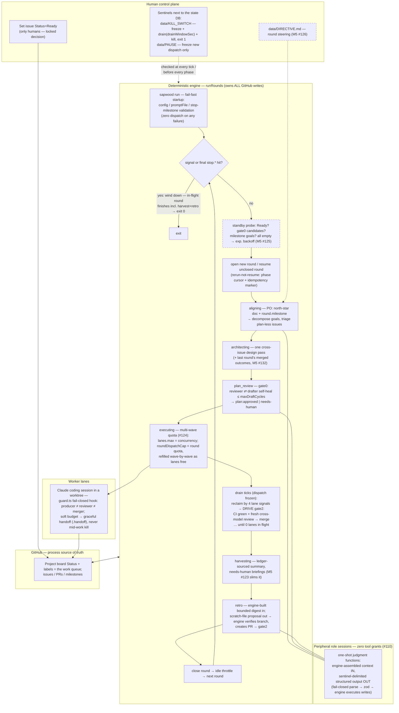
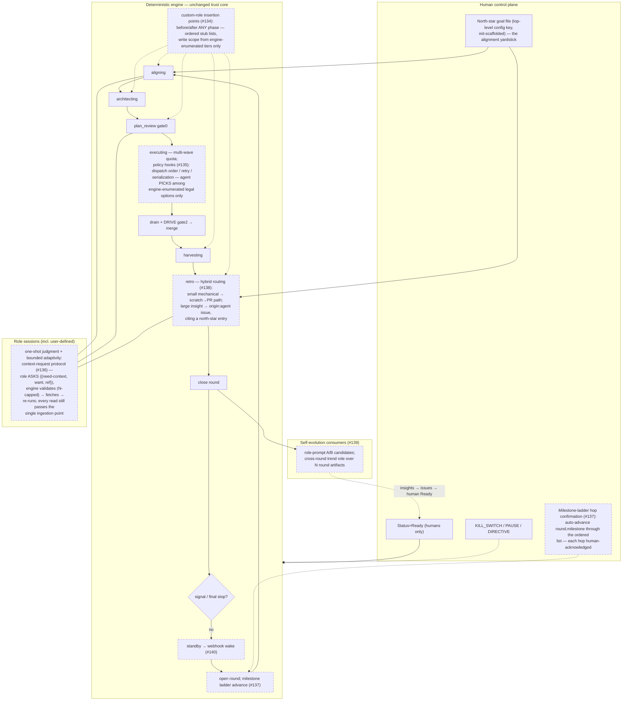

# System review — July 2026

Distilled outcomes of a full-system design review (2026-07-12): architecture
assessment, principles locked, mechanism clarifications, and the resulting
roadmap (milestone M5 for the current version; a v1.0 backlog for what must
wait). This is durable knowledge; the per-item execution detail lives in the
M5 / v1.0 issues that reference this document.

> Doc-structure note: filed as a standalone review document for now; fold into
> the docs architecture when the repo is prepared for public release.

## Architecture assessment: the deterministic top tier

sapwood's global controller is the deterministic TypeScript engine
(`runRounds`), not an agent. Every Claude session — worker, reviewer, and the
five peripheral roles — is a scoped, bounded, engine-spawned subordinate. The
top-tier position is deliberately reserved for code that cannot be
prompt-injected and cannot hallucinate, backed by the fail-closed guard hook.

**Strengths.** Worst-case damage is provable, not probabilistic: roles cannot
write GitHub directly (zero tool grants since #110), cannot approve or merge
their own work (guard hook), cannot outspend the ledgers. Deterministic
orchestration is debuggable, replayable (the dashboard's event-replay depends
on this), and costs no tokens.

**Weaknesses, and their compensation paths.**

1. *The engine's intelligence ceiling is whatever is coded.* Situational
   judgment (dispatch ordering, retry strategy, cross-PR sequencing) either
   falls to humans (`needs-human`) or to fixed rules. Compensation: smarter
   peripheral roles as **advisors** (structured suggestions the engine may
   adopt within hard bounds), never as commanders — and, post-v1.0, policy
   hooks where an agent picks among engine-enumerated options only.
2. *Evolution is stiff:* every new global behavior costs
   TypeScript + tests + gate②. Bought deliberately — provability over
   flexibility. Pressure valves: user-tunables in config, and the
   retro → gate② self-evolution channel (which needs live traffic to be
   proven).
3. *Judgment is sliced per phase* — no single perspective sees a whole round.
   Compensation: engine-built round summaries as standard input to
   harvest/retro; post-v1.0, a cross-round trend role.

**Net judgment:** the deterministic top tier is long-term correct, not a
staged compromise. The weaknesses all have compensation paths that preserve
the architecture; the core strength — provable containment — cannot be
recovered once given away.

## Principles locked by this review

1. **Validation depth ∝ decision weight.** Judgment flows back into the
   engine through structured output. The engine validates format and
   permission, not decision quality — so as a role's output gains decision
   weight (e.g. if aligning's output ever drives dispatch order, or retro's
   drives config), the engine-side validation of that output must deepen in
   proportion. Otherwise a de-facto conductor agent reassembles itself through
   the structured-output pipe, unnamed. A standing inventory (which role
   output drives which engine write, validated how) is the safety baseline
   for every future "bring judgment in" change.
2. **Don't make the engine smart — make it safe at consuming smart.**
   Additions of intelligence go into roles (advice) or bounded policy points
   (choices among engine-enumerated options), never into an open-ended
   engine-side reasoning step.
3. **Context via engine assembly, never open reads.** Issue/PR text is
   untrusted input; judgment roles' outputs drive gates directly, so their
   *input* must be controlled. The engine-built digest is the single
   ingestion point — where injection containment, provenance, boundedness
   (`digestMaxChars`), and auditability ("the digest text is exactly what the
   session saw") live once, for all roles. Context hunger is real, but the
   remedy is thickening the engine's assembly pipeline (and, post-v1.0, a
   bounded context-request protocol: the role *asks*, the engine fetches),
   not read grants. The worker/peripheral asymmetry is intentional: the
   worker reads freely inside a worktree because its output passes gate②;
   peripheral outputs *are* gate actions, so their inputs are curated.
4. **Authority answers live in layers.** For any "who can do X":
   *unreachable* (no tool channel exists — the strongest) > *intercepted*
   (guard hook) > *single choke point* (one engine call site). Prefer moving
   protections up this ladder; #110 moved role writes from pattern-deny
   (intercepted, leaky — see the #102 short-flag escape) to unreachable.

## Mechanism clarifications (state of the world, post-#119)

- **Round dispatch quota, multi-wave refill (#124, shipped).** `runExecuting`
  dispatches in waves: `lanes.max` bounds CONCURRENCY only (unchanged —
  tick()'s own lane-ceiling check); `roundDispatchCap` is the round's total
  work QUOTA, refilled wave-by-wave as lanes free, drawn from the same
  `plan:approved` pool the whole round through (governance-compatible:
  approval is issue-level and persistent; the architect pass already covered
  every candidate). The durable per-round dispatch count needed no new
  schema — it's read fresh, every wave decision, from the round's existing
  #123 ledger-window cursor (`start_event_id`) counting `dispatched` events,
  so a crash/restart mid-round never resets the quota nor lets a resumed
  drain (`freshBatch=false`) dispatch a further wave. The tick-driver
  (`driver.ts`, `engine.driver: tick`) is UNCHANGED: outside round.ts,
  `roundDispatchCap` stays a flat per-tick rate limit, re-armed every call —
  round.ts is the only caller that reinterprets it as a cross-tick quota,
  via `TickDeps.dispatchCapOverride`. Default raised 2 -> 6 (2x `lanes.max`'s
  own default: two full concurrency-wide waves) now that the cap is a real
  quota, not "round size" in disguise. Trade-off to tune: bigger rounds
  amortize peripheral cost but slow the retro feedback loop — quota is
  feedback granularity.
- **Stop vs scope are orthogonal.** `--stop-on-milestone M` = terminate when
  M has zero open issues (constrains nothing else); `round.milestone` (config
  only) = scope dispatch *and* peripherals to M. "Work only M, stop when
  done" requires both today; an ergonomic combined flag is an M5 item.
  Milestones have no ordering; a roadmap ladder is a v1.0 question because
  auto-advancing scope moves the human "what" boundary.
- **Kill switch drains, it does not wait.** Signal/stop-condition lets
  in-flight lanes *finish*; kill switch gives them `drainWindowSec` to hand
  off (WIP commit + `.handoff`), then hard-kills, skips remaining peripheral
  phases, exits 1 (the one non-zero rounds exit). On restart the round
  resumes from its persisted phase cursor (typically `harvesting`) and closes
  out before a new round opens.
- **Budget tiers:** worker `budgetUsdSoft` = graceful handoff (hard-killing
  workers would re-burn the same tokens on requeue forever and orphan dirty
  worktrees); round `roundBudgetUsd` = stops further work, never kills;
  global `dailyBudgetUsd` + `maxWallClockSec` (default **4h**) = the hard
  tier: freeze + drain + escalate. Post-hoc enforcement; bounded overshoot
  ≈ cap × worker soft budget.
- **"Alive but idle" diagnosis chain** (until the dashboard ships):
  1. `ls data/` — `PAUSE`/`KILL_SWITCH` sentinels;
  2. `sapwood status` — ceiling breached? (`maxWallClockSec` 4h is the
     usual overnight suspect; `dailyBudgetUsd` second) — a breached engine
     freezes dispatch but keeps ticking, which looks like a hang;
  3. board + lanes — everything escalated to `needs-human`/`blocked`, or a
     `driving` lane stuck on a conflicted PR (conflicts suppress CI
     silently: no merge ref, zero check-suites).
- **Structured-output conversion is complete** (#110 chain + #118/#119):
  `ROLE_ALLOWED_TOOLS = ""`; roles emit sentinel-delimited JSON(+body)
  blocks; the engine parses fail-closed, validates per-role zod schemas, and
  executes all GitHub writes itself. Retro is the extreme case: lost live
  browsing and `gh pr create`, given the engine-built digest (#118) and
  engine-side PR creation from a fail-closed scratch-file proposal with
  engine-verified branch existence (#119). The cost — roles became one-shot
  judgment functions — is repaid by the engine's context-assembly pipeline,
  which is why context work (below) concentrates on the engine side.

## Flow

Two views of the loop. **v0.2** is the walkthrough result: solid = shipped on
`main` today (post-#119); dashed = the M5 items that attach to it. **v1.0**
assumes M5 shipped (all solid) and highlights where the governed-extensibility
layer plugs in.

### v0.2 — the loop as reviewed (+ M5 attachment points)

Budget tiers overlay (not drawn per-edge): worker `budgetUsdSoft` → handoff
inside W1; round `roundBudgetUsd` → stops further waves inside EX1/EX2, never
kills; global `dailyBudgetUsd` + `maxWallClockSec` (4h) → engine-wide freeze +
drain, checked at every tick.

### v1.0 — the same loop with the governed-extensibility layer

The v1.0 layer never touches the trust core: every addition is either a
*human* affordance (ladder confirmation), a *bounded choice* (policy hooks),
or a *mediated capability* (context requests, tiered custom roles) — the
engine remains the only writer, and Principle 1's inventory (#121) is the
checklist each addition must update.

## Roadmap

### M5 — current version (ordered by ROI)

1. Structured-output write inventory + Principle 1 into PLAN.md (the
   baseline for everything below).
2. Rounds-driver live run on sapwood itself — prove the retro channel with
   real traffic; harvest the failure-semantics experience.
3. Engine-built round summary artifact (JSON as truth, markdown as view);
   harvest slims to judgment + needs-human briefing; shares the dashboard
   (#17) data contract; thread real aligning detail through to the architect.
4. Round dispatch quota: multi-wave refill up to `roundDispatchCap`;
   `lanes.max` = concurrency only; document the tick-driver divergence;
   re-justify the default.
5. Standby state: cheap pre-round probe (Ready / plan-review candidates /
   milestone goals via API), exponential backoff when all-empty; probe hit
   resets. (The #109 idle throttle paces; this parks.)
6. Round directive file (`data/DIRECTIVE.md`): human steering injected into
   aligning/architect prompts at round open, archived to the event log.
7. `roles.*.enabled` toggles (unset phase already defaults to noop — config
   key + factory skip only).
8. North-star promotion: `roles.architect.planMdPath` → top-level goal-file
   key; `sapwood init` scaffolds a template (goal / non-goals / constraints /
   current milestone); retro proposals must cite it.
9. `--milestone M` CLI shortcut = scope + stop in one flag.
10. Role paradigm spec doc (responsibility / write scope / idempotency /
    validation / escalation); document plan-reviewer+drafter as one gate⓪
    adversarial pair.
11. Issue templates by category + plan-drafter normalizes toward them (soft,
    prompt-level; gate⓪ keeps owning the semantic bar).
12. Architect post-review context: feed last round's merged outcomes into the
    next pre-dispatch pass (closes the "who reviews merged architecture"
    gap without a new phase).
13. Fix `/sapwood-run` command doc drift (pre-#106 `--once`/daemon notes).

### v1.0 backlog (each expands a trust surface; needs live-run data first)

- **Governed extension points:** user-defined roles and before/after
  insertion at any phase — orchestration *with* governance (write scopes
  chosen from engine-enumerated tiers, schema-validated output, marker
  idempotency). Depends on M5 items 1 & 10.
- **Policy hooks:** engine decision points (dispatch order, retry, serialization)
  where an agent picks among engine-enumerated legal options only.
- **Context-request protocol:** bounded, engine-mediated follow-up reads for
  one-shot judgment roles (role asks, engine fetches, re-runs; N capped).
- **Milestone ladder:** auto-advance `round.milestone` through the ordered
  config `milestones` list — decide first whether a human confirms each hop.
- **Retro issue-proposal channel:** hybrid — small mechanical changes keep
  the PR path; larger insights become `origin:agent` issues a human moves to
  Ready (the urgency of this dropped after #119 unified retro's trust model).
- **Role-prompt self-evolution (A/B) and a cross-round trend role** — both
  need round history that doesn't exist yet.
- **Event-driven wake** (webhook) to replace standby polling.
